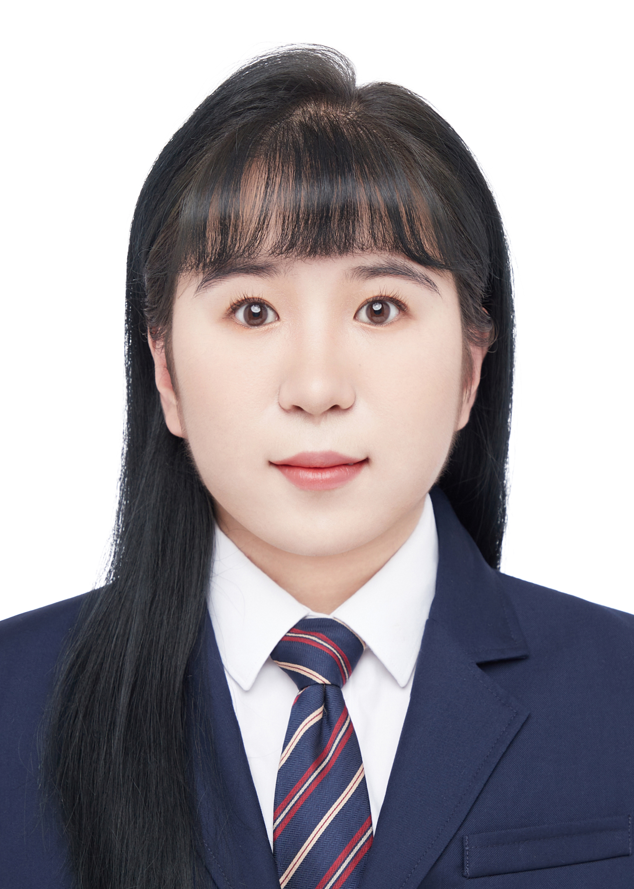

# Introduction
Hi! I'm ZHENG-RUYA, a student in the Framework-Based Software Design and Development course. 
I hope to study the relevant knowledge of software framework in a more systematic way and be able to independently build a complete software framework.
English is not my native language. This is the first time I'm studying in an English-speaking environment. Although it's a big challenge for me, I won't give up because I love the major of computer science.
  <!-- Link to the uploaded image -->

## GitHub Profile

You can view my personalized GitHub profile [here](https://github.com/ZHENG-RUYA)

